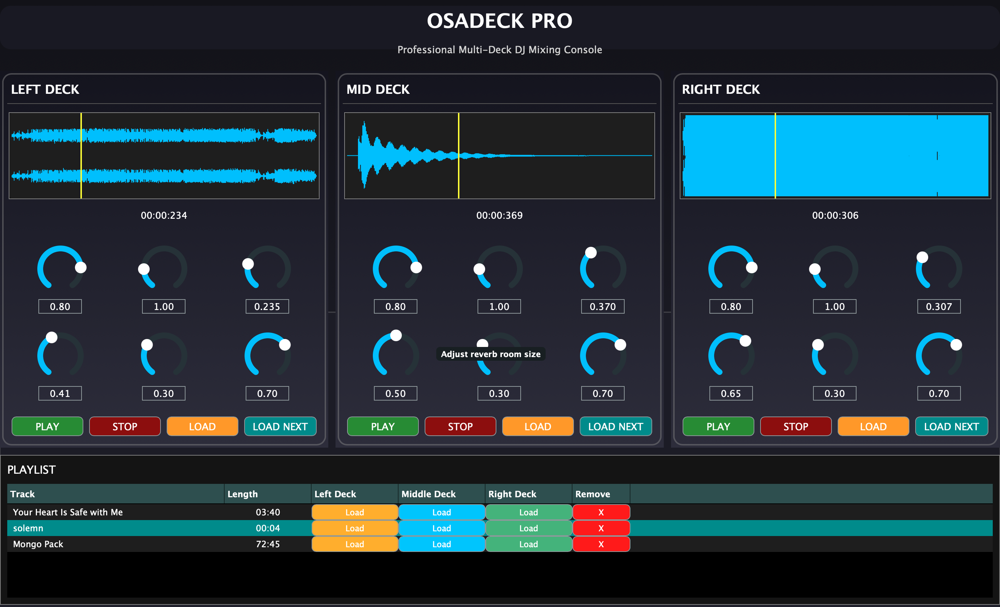
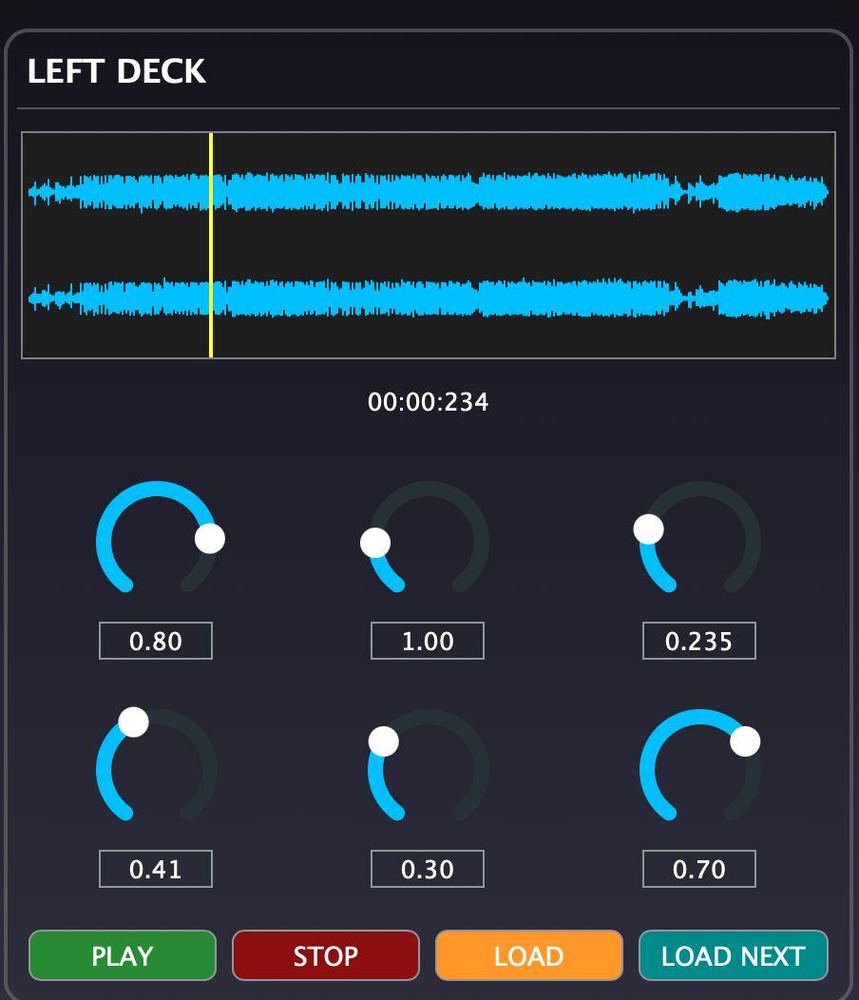
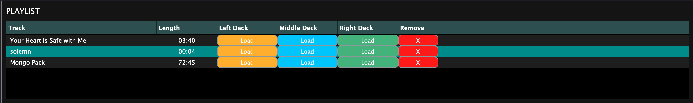
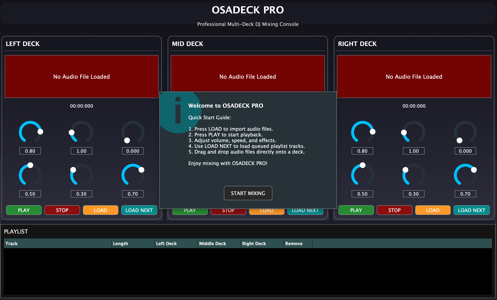
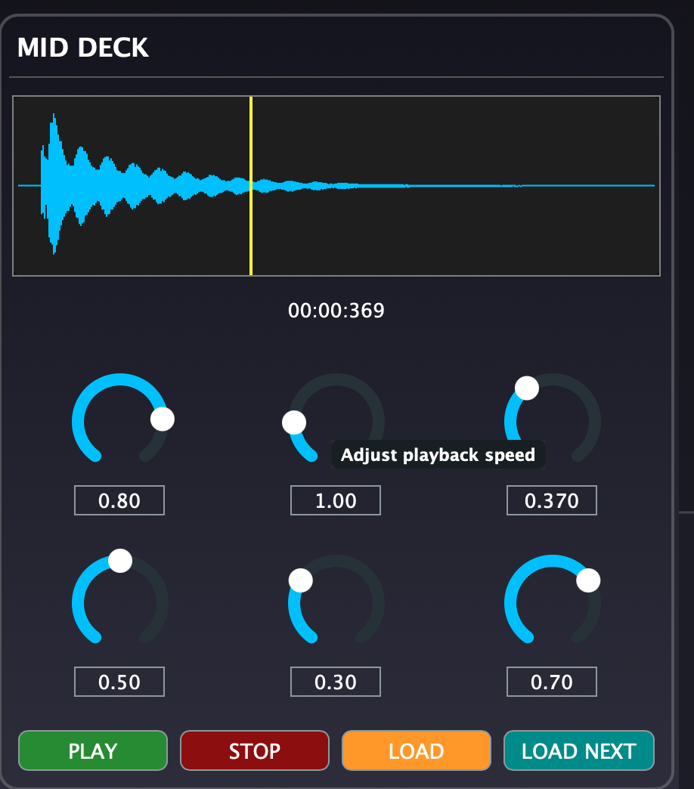
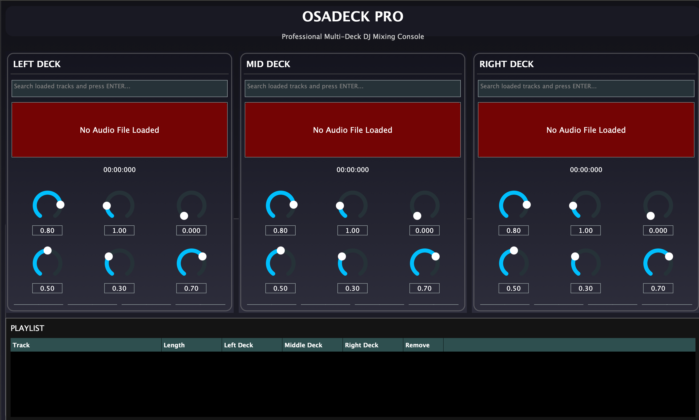

# OSADECK — Multi-Deck DJ Audio Application 🎧

OSADECK is a modern desktop DJ and audio playback application built with **C++17** and the **JUCE Framework**.

The application simulates a simplified DJ mixing environment with three independent audio decks, real-time waveform visualization, playlist management, playback manipulation, and audio effects processing.

Developed as a multimedia software engineering project, OSADECK demonstrates practical concepts in:

* real-time audio programming
* GUI application development
* event-driven systems
* modular software architecture
* object-oriented design using modern C++

---

# Preview

## Main Interface



Triple-deck DJ mixing environment with waveform visualization and playlist management.

---

## Deck Controls



Each deck includes:

* playback controls
* waveform display
* speed adjustment
* effects controls
* track positioning

---

## Playlist Queue System



Queue tracks independently for each deck using the **LOAD NEXT** feature.

---

## Onboarding Popup



Built-in onboarding helps first-time users understand the interface quickly.

---

## Tooltip System



Interactive tooltips improve usability and accessibility.

---

## 🔍 Playlist Search Functionality

### Features

* Instant playlist searching
* Case-insensitive matching
* Automatic playlist row selection
* Fast track navigation during live mixing



Search for tracks directly from any deck using the integrated playlist search box.

---

# Features

* 🎵 Three independent audio decks
* 🌊 Real-time waveform visualization
* 📂 Playlist and track management
* 🖱 Drag-and-drop audio loading
* ⏯ Play and stop controls
* 🎚 Volume control
* ⏩ Playback speed adjustment
* 📍 Track position seeking
* 🔊 Reverb audio effects
* 🎧 Real-time audio processing
* 🔍 Playlist search functionality
* 🖥 Interactive JUCE-based graphical interface

---

# Technical Highlights

* Multi-deck audio routing
* JUCE `AudioTransportSource` integration
* Real-time waveform rendering
* Resampling audio pipeline
* Reverb audio processing
* Dynamic playlist interaction
* Event-driven GUI architecture
* Component-based modular design
* Modern C++ memory management
* Drag-and-drop file handling

---

# Technologies

* C++17
* JUCE Framework
* Real-Time Audio Processing
* Object-Oriented Programming (OOP)
* Event-Driven Programming
* Audio DSP Concepts

---

# Development Tools

* Xcode
* Projucer
* Git
* VS Code (optional editor)

---

# Supported Platforms

| Platform | Status            |
| -------- | ----------------- |
| macOS    | ✅ Fully Supported |
| Windows  | ⚠️ Untested       |
| Linux    | ⚠️ Experimental   |

---

# Project Structure

```bash
OSADECK/
├── README.md
├── Source/
│   ├── Main.cpp
│   ├── MainComponent.cpp
│   ├── MainComponent.h
│   ├── DJAudioPlayer.cpp
│   ├── DJAudioPlayer.h
│   ├── DeckGUI.cpp
│   ├── DeckGUI.h
│   ├── WaveFormDisplay.cpp
│   ├── WaveFormDisplay.h
│   ├── PlaylistComponent.cpp
│   ├── PlaylistComponent.h
│   ├── TrackList.cpp
│   └── TrackList.h
├── Builds/
│   └── MacOSX/
└── assets/
```

---

# Core Components

| Component           | Description                                                                                              |
| ------------------- | -------------------------------------------------------------------------------------------------------- |
| `DJAudioPlayer`     | Handles audio loading, playback, transport control, resampling, gain control, seeking, and audio effects |
| `DeckGUI`           | Provides deck controls, waveform interaction, sliders, and playback UI                                   |
| `WaveFormDisplay`   | Renders waveform thumbnails and playback positions                                                       |
| `PlaylistComponent` | Manages playlist interactions, drag-and-drop loading, and deck queueing                                  |
| `TrackList`         | Stores and organizes track metadata                                                                      |
| `MainComponent`     | Coordinates the application layout, mixer, and audio engine                                              |

---

# Application Architecture

OSADECK separates responsibilities into modular components:

* Audio processing layer
* Waveform rendering layer
* Graphical user interface layer
* Playlist management system
* Deck interaction system

This modular architecture improves:

* maintainability
* scalability
* readability
* component reusability

---

# How It Works

OSADECK uses JUCE audio components to:

* load audio files
* stream audio in real time
* visualize waveforms
* manipulate playback speed
* control gain and transport position
* apply real-time reverb effects
* manage multi-deck playback

Tracks can be:

* loaded directly into decks
* dragged into the playlist
* queued into specific decks
* searched within the playlist

---

# Prerequisites

Before running the project, install:

* JUCE Framework
* Xcode (macOS)
* Git
* A C++17 compatible compiler

---

# Installation

## Clone the Repository

```bash
git clone https://github.com/Brightiya/OSADECK.git
cd OSADECK
```

---

# JUCE Setup

This project uses the JUCE Projucer workflow rather than CMake.

## Install JUCE

Download JUCE from:

https://juce.com/get-juce/download

---

# Opening the Project

## Open the `.jucer` File

```bash
open OSADECK.jucer
```

Or open it directly using Projucer.

---

# Configure JUCE Modules

Ensure the following JUCE modules are enabled:

* juce_core
* juce_events
* juce_graphics
* juce_gui_basics
* juce_gui_extra
* juce_audio_basics
* juce_audio_formats
* juce_audio_utils
* juce_audio_devices

---

# Export to Xcode

Inside Projucer:

```text
File → Save Project and Open in IDE
```

This automatically generates the Xcode project.

---

# Running the Application

In Xcode:

```text
Press ▶ Run
```

The application launches as a desktop DJ audio player.

---

# Using VS Code

You may also edit the project using VS Code:

```bash
code .
```

However, building and exporting are handled through:

* Projucer
* Xcode

rather than directly through VS Code.

---

# Current Functionality

The current implementation supports:

* audio file loading
* waveform rendering
* playlist management
* drag-and-drop audio importing
* playback control
* speed adjustment
* gain control
* playback position tracking
* real-time reverb manipulation
* deck queue management

---

# Current Limitations

Current limitations include:

* No BPM analysis
* No key detection
* No crossfader implementation
* Limited DSP effects
* No persistent playlist storage
* No audio recording/export
* No streaming platform integration

---

# Future Improvements

Planned future enhancements:

* BPM detection
* Crossfader implementation
* Equalizer and audio filters
* Audio recording/exporting
* Persistent playlist storage
* Keyboard shortcuts
* Improved UI responsiveness
* Streaming integration
* Beat synchronization
* Cue point support

---

# Learning Outcomes

This project demonstrates:

* audio software engineering
* JUCE framework integration
* real-time multimedia systems
* event-driven GUI programming
* modular software architecture
* modern C++ development
* audio DSP fundamentals

---

# Contributing

Contributions are welcome.

1. Fork the repository
2. Create a feature branch
3. Commit your changes
4. Push your branch
5. Open a Pull Request

---

# License

This project is licensed under the MIT License.

---

# Author

## Bright O Iyahen

GitHub:
<https://github.com/Brightiya>
